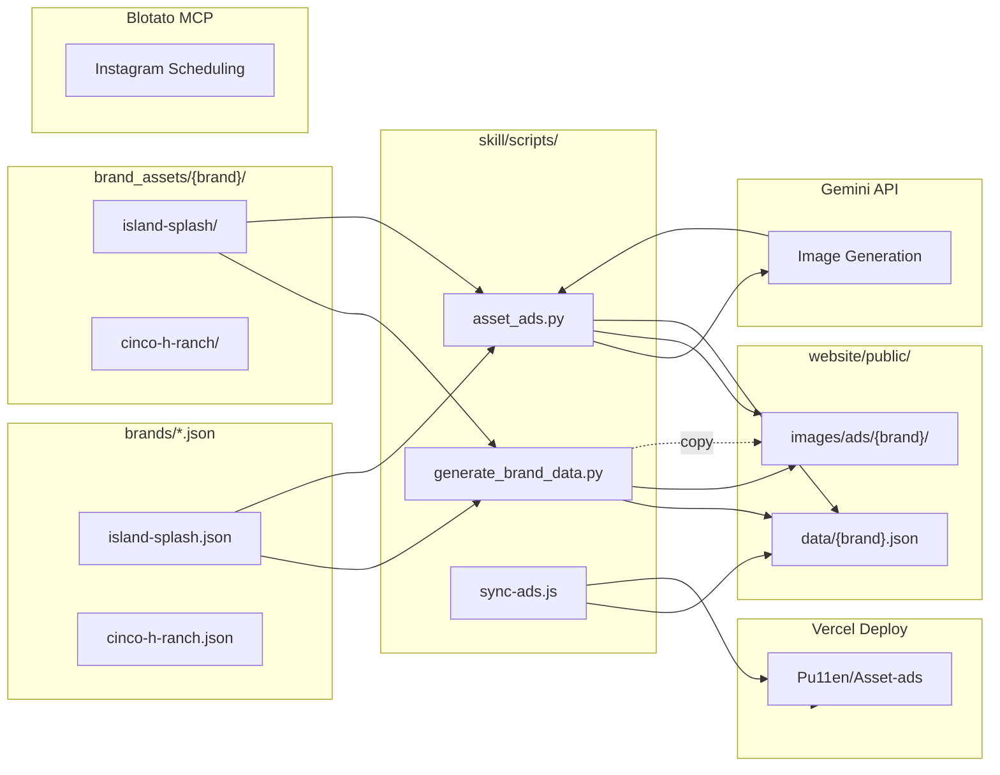

# Asset-Ads — Project Structure

## Clean Architecture

```
asset-ads/
│
├── brands/                              # Brand configs (git-tracked)
│   ├── island-splash.json               # Island Splash config
│   └── cinco-h-ranch.json               # Cinco H Ranch config
│
├── brand_assets/                        # Source images (gitignored)
│   ├── island-splash/
│   │   ├── logo/                        # Brand logo
│   │   └── references/
│   │       └── all-drinks/              # Ref pool for all flavors
│   └── cinco-h-ranch/
│       ├── logo/
│       ├── products/                    # Product images
│       │   ├── honey-vanilla-soap.png
│       │   ├── rejuvenating.png
│       │   └── sunscreen.png
│       └── references/                  # Per-product ref pools
│           ├── soap/
│           ├── cream/
│           └── sunscreen/
│
├── output/                              # Generated ads (gitignored)
│   ├── ads/
│   ├── archive/
│   └── posts/
│
├── skill/                               # Hermes agent skill
│   ├── SKILL.md                         # Entry point
│   ├── assets/
│   ├── references/
│   │   ├── brand-config-schema.md
│   │   ├── onboard-brand.md
│   │   ├── add-refs.md
│   │   ├── ad-generation-pipeline.md
│   │   └── schedule-post.md
│   └── scripts/                         # Agent automation scripts
│       ├── onboard_brand.py             # Onboard new brand
│       ├── add_refs.py                  # Add reference images
│       ├── drain_board.py               # Drain Pinterest board
│       ├── generate_brand_data.py       # Sync assets → website
│       ├── schedule_post.py             # Schedule via Blotato
│       └── sync-ads.js                  # Sync to Vercel deploy
│
├── docs/                                # Documentation
├── .gitignore
├── SPEC.md                              # Full specification
├── README.md
├── .env
│
└── website/                             # Next.js site (Vercel deploy)
    ├── public/
    │   ├── data/
    │   │   ├── island-splash.json        # Ad manifest per brand
    │   │   ├── cinco-h-ranch.json
    │   │   ├── brand-assets.json         # Brand asset overview
    │   │   ├── ads.json                  # Legacy combined ads
    │   │   └── scheduled/               # Scheduled post data
    │   │       ├── island-splash.json
    │   │       └── cinco-h-ranch.json
    │   └── images/
    │       ├── ads/
    │       │   ├── island-splash/        # Island Splash generated ads
    │       │   └── cinco-h-ranch/        # Cinco H Ranch generated ads
    │       └── products/                 # Product images
    │           ├── island-splash/
    │           └── cinco-h-ranch/
    └── src/
        ├── app/
        │   ├── page.tsx                 # Password gate (/)
        │   ├── [brand]/page.tsx         # Brand page (/island-splash)
        │   ├── layout.tsx
        │   ├── globals.css
        │   └── actions.ts               # Sign in/out actions
        └── lib/
            ├── brands.ts                # Brand definitions
            └── ads.ts                   # Ad loading utilities
```

## Data Flow



## What Changed

1. **Deleted scratch folders** — `images/`, `references/`, `site/`, `products_downloaded/`, `media/`, `refs/`, `logs/`, `state/`, `src/`, `website/images/`
2. **Website replaced** — copied deploy repo (`asset-ads-site/`) structure with proper:
   - Password-gated auth (`/`)
   - Brand routes (`/[brand]`)
   - Scheduled tab
3. **asset_ads.py fixed** — now syncs to `website/public/images/ads/{brand}/` and updates `website/public/data/{brand}.json`
4. **sync-ads.js exists** — in `skill/scripts/`, already present

## Routes

| URL | Auth | Content |
|-----|------|---------|
| `/` | Password form | Gate — enter brand password |
| `/island-splash` | Password cookie | Island Splash ads + scheduled |
| `/cinco-h-ranch` | Password cookie | Cinco H Ranch ads + scheduled |

Passwords: `ahmeer` (island-splash), `carol` (cinco-h-ranch)